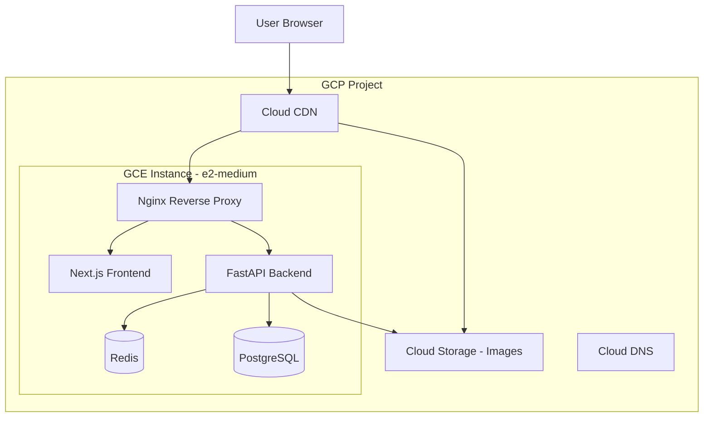
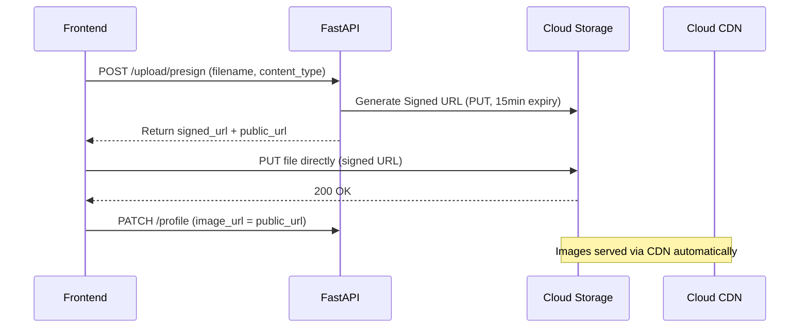
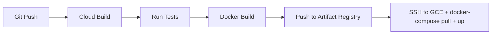
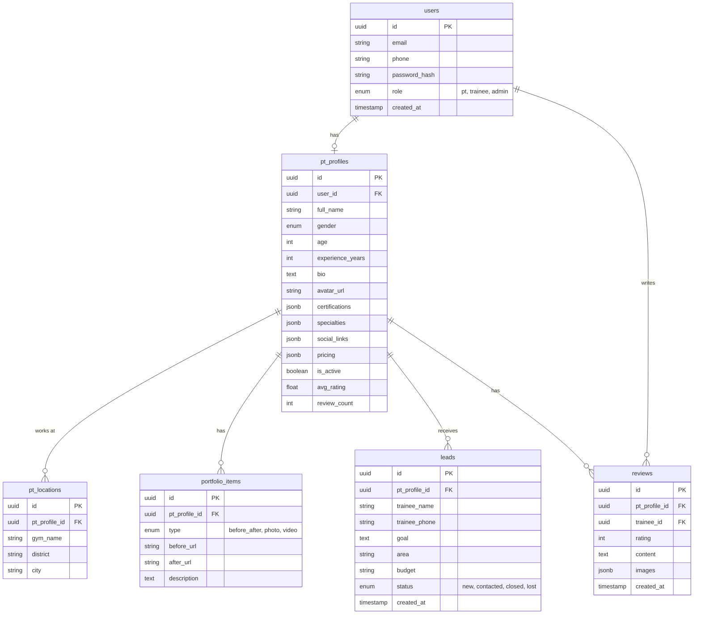

# PTMatch MVP - Implementation Plan

## Architecture Overview



**Tech Stack chi tiet:**
- **Frontend**: Next.js 15 (App Router, Server Components, SSR cho SEO)
- **Backend**: Python 3.12 + FastAPI (auto-docs, async, dễ mở rộng cho AI sau này)
- **Database**: PostgreSQL 16 trên GCE (self-hosted, tiết kiệm chi phí MVP)
- **Cache**: Redis 7 trên GCE (same instance)
- **Storage**: Google Cloud Storage (images, portfolio) + Cloud CDN
- **Auth**: JWT + Refresh Token (hỗ trợ Zalo OAuth sẵn cho Phase 5)
- **Infra**: GCE e2-medium, managed bằng Terragrunt/Terraform
- **Deployment**: Docker Compose trên GCE, CI/CD qua Cloud Build
- **DNS/SSL**: Cloud DNS + Let's Encrypt (auto-renew via certbot)

---

## GCP Infrastructure (Terragrunt)

### Architecture Decision: Single GCE vs Multi-service

Cho MVP, dùng **single GCE instance** chạy Docker Compose (tất cả services trên 1 máy) để tiết kiệm chi phí. Khi scale lên sẽ tách ra Cloud Run / GKE.

**Cost estimate (MVP):**
- GCE e2-medium (2 vCPU, 4GB RAM): ~$25/month
- GCS (50GB images): ~$1/month
- Cloud CDN: ~$5/month (low traffic)
- Cloud DNS: ~$0.5/month
- **Total: ~$30-35/month**

### Terragrunt Project Structure

```
infra/
├── terragrunt.hcl                    # Root config (GCP provider, remote state)
├── environments/
│   ├── dev/
│   │   ├── env.hcl                   # Dev-specific vars
│   │   ├── network/
│   │   │   └── terragrunt.hcl        # VPC, Firewall
│   │   ├── compute/
│   │   │   └── terragrunt.hcl        # GCE instance
│   │   ├── storage/
│   │   │   └── terragrunt.hcl        # GCS bucket
│   │   ├── cdn/
│   │   │   └── terragrunt.hcl        # Cloud CDN + LB
│   │   └── dns/
│   │       └── terragrunt.hcl        # Cloud DNS
│   └── prod/
│       ├── env.hcl
│       ├── network/
│       │   └── terragrunt.hcl
│       ├── compute/
│       │   └── terragrunt.hcl
│       ├── storage/
│       │   └── terragrunt.hcl
│       ├── cdn/
│       │   └── terragrunt.hcl
│       └── dns/
│           └── terragrunt.hcl
└── modules/                          # Shared Terraform modules
    ├── network/
    │   └── main.tf                   # VPC, subnet, firewall rules
    ├── compute/
    │   └── main.tf                   # GCE instance, service account
    ├── storage/
    │   └── main.tf                   # GCS bucket, IAM, lifecycle
    ├── cdn/
    │   └── main.tf                   # Backend bucket, URL map, CDN
    └── dns/
        └── main.tf                   # DNS zone, records
```

### Infrastructure Components

**1. Network (VPC + Firewall)**
- Custom VPC với 1 subnet (asia-southeast1 - Singapore, gần VN)
- Firewall rules: allow HTTP/HTTPS (80, 443), SSH (restricted IP), deny all else
- Internal firewall: allow communication giữa services trên cùng VPC

**2. Compute (GCE)**
- Machine type: `e2-medium` (2 vCPU, 4GB RAM) - đủ cho MVP
- OS: Ubuntu 24.04 LTS
- Boot disk: 30GB SSD (pd-balanced)
- Static external IP (reserved)
- Service account với quyền GCS access
- Startup script: install Docker, docker-compose, pull images
- SSH key managed qua Terraform (không dùng OS Login cho đơn giản)

**3. Storage (GCS)**
- Bucket: `ptmatch-media-{env}` (regional - asia-southeast1)
- Lifecycle: delete incomplete multipart uploads after 7 days
- CORS configured cho frontend upload
- IAM: Service account có `storage.objectCreator` + `storage.objectViewer`
- Separate bucket cho backups: `ptmatch-backups-{env}`

**4. CDN (Cloud CDN)**
- Backend bucket pointing to GCS (serve images qua CDN)
- Cache policy: cache images 30 days, cache-control headers
- HTTPS certificate (Google-managed SSL)
- URL: `cdn.ptmatch.vn` (hoặc subdomain khác)

**5. DNS (Cloud DNS)**
- Zone: `ptmatch.vn`
- A record -> GCE external IP
- CNAME: `cdn.ptmatch.vn` -> CDN endpoint

### Terragrunt Root Config

```hcl
# infra/terragrunt.hcl
locals {
  project_id = "ptmatch-prod"  # or ptmatch-dev
  region     = "asia-southeast1"
  zone       = "asia-southeast1-b"
}

remote_state {
  backend = "gcs"
  config = {
    bucket   = "ptmatch-terraform-state"
    prefix   = "${path_relative_to_include()}/terraform.tfstate"
    project  = local.project_id
    location = local.region
  }
}

generate "provider" {
  path      = "provider.tf"
  if_exists = "overwrite_terragrunt"
  contents  = <<EOF
terraform {
  required_providers {
    google = {
      source  = "hashicorp/google"
      version = "~> 5.0"
    }
  }
}

provider "google" {
  project = "${local.project_id}"
  region  = "${local.region}"
  zone    = "${local.zone}"
}
EOF
}
```

### GCS Upload Flow (Application Level)



Upload dùng **Signed URLs** - frontend upload trực tiếp lên GCS, không qua backend (giảm bandwidth + latency).

### CI/CD Pipeline (Cloud Build)



- Trigger: push to `main` branch
- Steps: test -> build -> push to Artifact Registry -> deploy to GCE
- Deployment: SSH vào GCE, pull new images, `docker-compose up -d`
- Rollback: revert git commit -> re-trigger build

### Backup Strategy

- PostgreSQL: daily pg_dump -> GCS backup bucket (retain 30 days)
- Cron job trên GCE instance (hoặc Cloud Scheduler cho production)

---

## Database Schema (MVP)



---

## Project Structure

```
ptmatch/
├── infra/                        # Terragrunt/Terraform IaC
│   ├── terragrunt.hcl            # Root config
│   ├── environments/
│   │   ├── dev/
│   │   └── prod/
│   └── modules/
│       ├── network/
│       ├── compute/
│       ├── storage/
│       ├── cdn/
│       └── dns/
├── frontend/                     # Next.js 15
│   ├── app/
│   │   ├── (public)/             # Public pages (no auth)
│   │   │   ├── page.tsx          # Landing page
│   │   │   ├── pts/              # PT listing + search
│   │   │   └── pt/[slug]/        # PT profile (SSR, SEO)
│   │   ├── (auth)/               # Auth pages
│   │   │   ├── login/
│   │   │   └── register/
│   │   ├── dashboard/            # PT Dashboard (protected)
│   │   │   ├── leads/
│   │   │   ├── profile/
│   │   │   ├── portfolio/
│   │   │   └── reviews/
│   │   └── layout.tsx
│   ├── components/
│   ├── lib/
│   └── public/
├── backend/                      # Python FastAPI
│   ├── app/
│   │   ├── api/
│   │   │   ├── auth.py
│   │   │   ├── pts.py
│   │   │   ├── leads.py
│   │   │   ├── reviews.py
│   │   │   └── upload.py         # GCS signed URL generation
│   │   ├── models/
│   │   ├── schemas/
│   │   ├── services/
│   │   │   └── gcs.py            # GCS client wrapper
│   │   ├── core/
│   │   │   ├── config.py
│   │   │   ├── security.py
│   │   │   └── database.py
│   │   └── main.py
│   ├── alembic/                  # DB migrations
│   ├── tests/
│   └── requirements.txt
├── scripts/                      # Deployment & maintenance
│   ├── deploy.sh                 # Docker deploy script
│   ├── backup-db.sh              # PostgreSQL backup -> GCS
│   └── setup-server.sh           # Initial GCE setup
├── docker-compose.yml            # Dev environment
├── docker-compose.prod.yml       # Production overrides
├── cloudbuild.yaml               # CI/CD pipeline
└── README.md
```

---

## MVP Features Breakdown

### 1. PT Profile (public, SSR)
- Trang profile chuẩn SEO (`/pt/[slug]`) - Server-rendered cho Google index
- Avatar upload với resize/optimize
- Specialties hiển thị dạng tags
- Bảng giá hiển thị rõ ràng
- Portfolio gallery (before/after slider)
- Social links + CTA liên hệ
- Schema.org markup cho Local Business SEO

### 2. PT Search
- Full-text search PostgreSQL (tsvector) - không cần Elasticsearch cho MVP
- Filters: gender, specialty, area, price range, experience
- Kết quả paginated, sortable (rating, price, experience)
- Server-side rendering cho SEO (search results indexable)

### 3. Lead Form
- Form đơn giản (tên, SĐT, mục tiêu, khu vực, ngân sách)
- Không cần đăng ký tài khoản để gửi lead (giảm friction)
- Rate limiting (chống spam)
- Optional: OTP verify SĐT qua SMS

### 4. PT Dashboard
- Lead management (Kanban-style: new -> contacted -> closed/lost)
- Profile editor (WYSIWYG cho bio)
- Portfolio manager (upload, reorder, delete)
- Review overview + stats
- Basic analytics (views, leads this month)

### 5. Review System
- Rating 1-5 stars + text + optional images
- Chỉ trainee đã verified (qua lead form hoặc account) mới review được
- PT có thể reply reviews
- Anti-fake: rate limit, moderation queue cho first review

---

## Ideas bo sung (ngoai spec)

### SEO & Growth
- **PT Profile as landing page**: Mỗi PT có URL đẹp (`ptmatch.vn/pt/nguyen-van-a`) - đây là thứ PT chia sẻ lên Facebook/Zalo, giống "danh thiếp online"
- **Blog/Content SEO**: Trang "Tìm PT [quận/thành phố]" tự động generate cho local SEO
- **PT Badge/Widget**: Embed badge trên Facebook/Instagram story

### UX Improvements
- **Quick Match CTA**: Ngay trang chủ có form ngắn "Bạn muốn tập gì? Ở đâu?" -> gợi ý 3 PT phù hợp nhất (rule-based, chưa cần AI)
- **Compare PTs**: Cho phép so sánh 2-3 PT side-by-side
- **PT "đang rảnh"**: Indicator PT có slot trống trong tuần (tự PT update)

### Technical
- **Slug-based URLs** cho PT profiles thay vì UUID - tốt cho SEO và sharing
- **Image optimization pipeline**: Upload -> GCS -> Cloud CDN (auto WebP via Accept header)
- **Webhook Zalo OA** sẵn từ đầu: Khi có lead mới -> notify PT qua Zalo (thay vì email)
- **PWA**: Cho phép PT "install" dashboard trên mobile home screen
- **GCS Signed URLs**: Frontend upload trực tiếp lên GCS, backend chỉ generate URL -> giảm server load

### Monetization (chuẩn bị sẵn)
- Thiết kế DB có field `subscription_tier` từ đầu
- Feature flags cho Pro/Premium features
- Stripe/VNPay integration placeholder

---

## API Endpoints (MVP)

**Auth:**
- `POST /auth/register` - Đăng ký (PT hoặc Trainee)
- `POST /auth/login` - Đăng nhập
- `POST /auth/refresh` - Refresh token
- `POST /auth/zalo` - Zalo OAuth (placeholder)

**PT Profiles:**
- `GET /pts` - Search/list PTs (public)
- `GET /pts/{slug}` - PT profile detail (public)
- `PUT /pts/me` - Update own profile (auth)
- `POST /pts/me/portfolio` - Upload portfolio item (auth)

**Leads:**
- `POST /leads` - Submit lead (public, rate-limited)
- `GET /leads` - List leads for PT (auth)
- `PATCH /leads/{id}/status` - Update lead status (auth)

**Reviews:**
- `POST /pts/{slug}/reviews` - Submit review
- `GET /pts/{slug}/reviews` - List reviews (public)
- `POST /reviews/{id}/reply` - PT reply (auth)

**Upload:**
- `POST /upload/image` - Upload image, return URL

---

## Implementation Order

Chia thành 5 sprints (Sprint 0 ngắn ~3-5 ngày, còn lại ~1.5-2 tuần):

**Sprint 0 - Infrastructure (3-5 days):**
- GCP project setup (billing, APIs enable)
- Terragrunt modules: network, compute, storage, cdn, dns
- `terragrunt run-all apply` cho dev environment
- GCE instance: install Docker, docker-compose
- GCS bucket: CORS config, CDN setup
- SSL certificate + domain pointing
- CI/CD pipeline (Cloud Build -> GCE deploy)

**Sprint 1 - Foundation:**
- Project setup (Docker Compose local + production)
- Auth system (register, login, JWT)
- Database schema + migrations (Alembic)
- Basic PT profile CRUD
- GCS upload service (signed URLs)

**Sprint 2 - Core Features:**
- PT profile public page (SSR + SEO)
- Image upload pipeline (frontend -> GCS direct upload)
- Portfolio manager
- PT search with filters

**Sprint 3 - Lead & Review:**
- Lead form (public)
- Lead dashboard (PT)
- Review system
- Email/Zalo notification khi có lead mới

**Sprint 4 - Polish & Launch:**
- Landing page
- Analytics dashboard cho PT
- Performance optimization (Cloud CDN caching rules)
- Mobile responsive polish
- Production deploy (Terragrunt prod env)
- DB backup cron job
- Monitoring (Cloud Monitoring alerts: CPU, disk, uptime)
